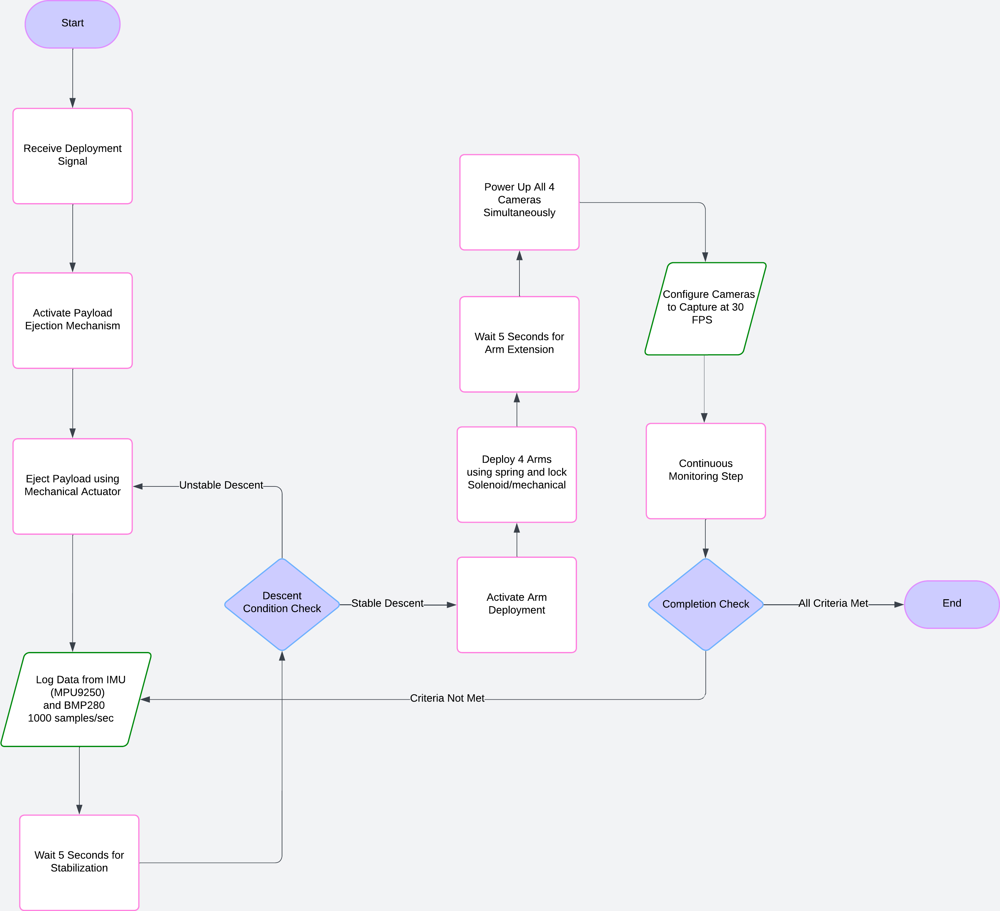

# KMUTTxSPACEPORT2025-Payload-3U-Mission

## Overview
The `KMUTTxSPACEPORT2025-Payload-3U-Mission` is an innovative satellite project designed to achieve dual objectives using a 3U CubeSat platform. The mission focuses on advancing space technology, fostering collaboration, and addressing critical challenges in satellite communication and data continuity.

## Objectives
### 1. Collaborative Imaging with 3D Modeling
- Capture high-resolution images of the mission rocket featuring corporate branding or logos from partnered organizations.
- Develop detailed 3D models from the captured images to commemorate and showcase collaboration between public and private entities in space exploration.

### 2. Real-Time Signal Outage Mitigation and Analysis
- Implement an advanced system within the payload to predict and reconstruct data lost during signal outages in orbit.
- Support continuous data analysis for critical decision-making, even in communication blackout scenarios.
- Provide insights into the management of signal disruptions for future space missions.

## Key Features
- **Predictive Data Systems**: Ensures seamless data analysis by filling gaps caused by signal interruptions during orbital operations.
- **Advanced Imaging Technology**: Captures and processes imagery with precision, aiding in both documentation and partner visibility.
- **Environmental Adaptability**: Designed to function effectively in harsh space environments, including extreme temperatures and radiation exposure.
- **Research and Innovation**: Contributes valuable insights for improving satellite communication resilience in low Earth orbit (LEO).

## Significance
- Demonstrates KMUTT's leadership in satellite innovation and resilience technology.
- Strengthens partnerships through visible collaboration and corporate branding opportunities.
- Provides actionable data for advancing future missions in space technology and satellite communication.

## Technical Specifications
- **Platform**: 3U CubeSat
- **Primary Payload**: Imaging system and predictive algorithm module
- **Mission Duration**: TBD
- **Orbit**: Low Earth Orbit (LEO)

---

This mission represents KMUTT's commitment to pushing the boundaries of space exploration, fostering collaboration, and addressing global challenges in satellite technology.
